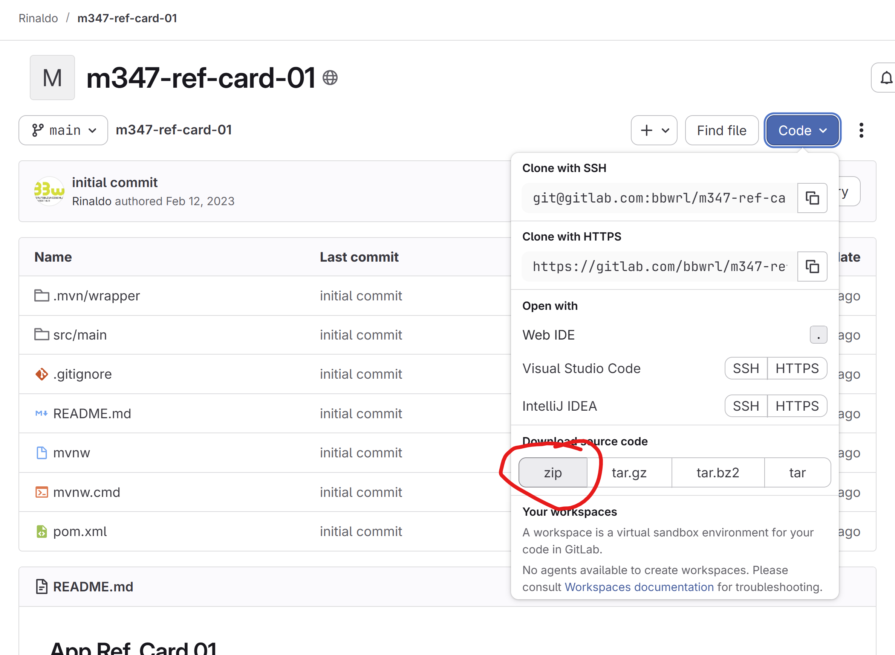
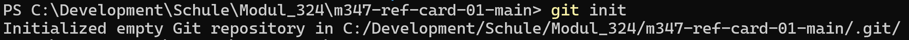
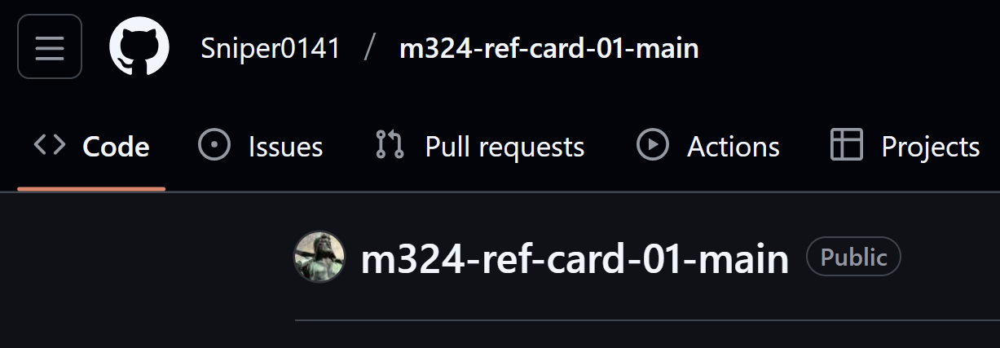
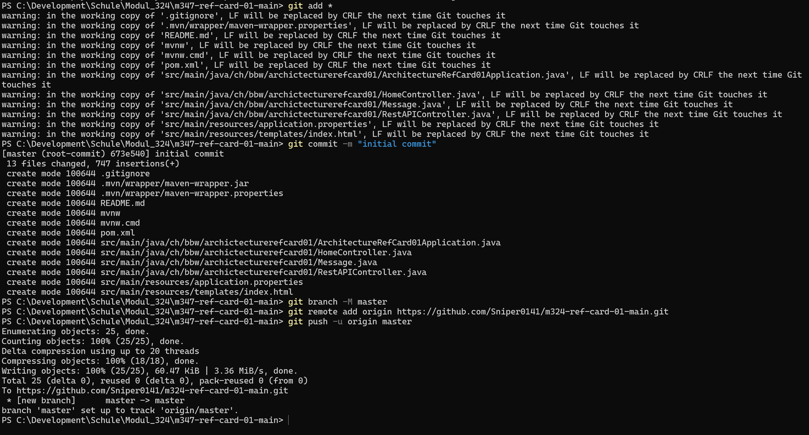
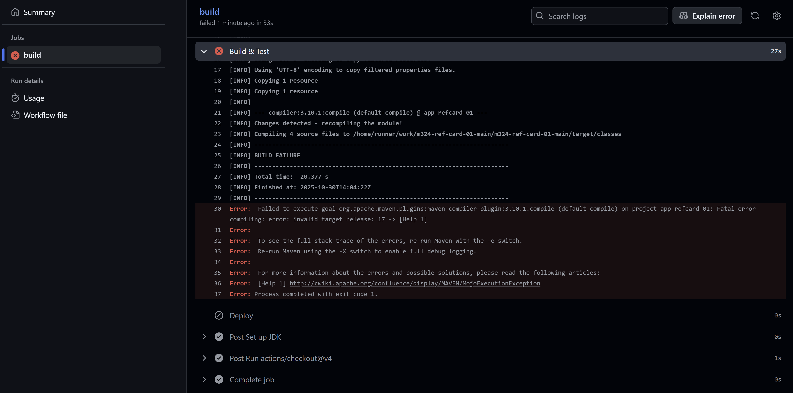
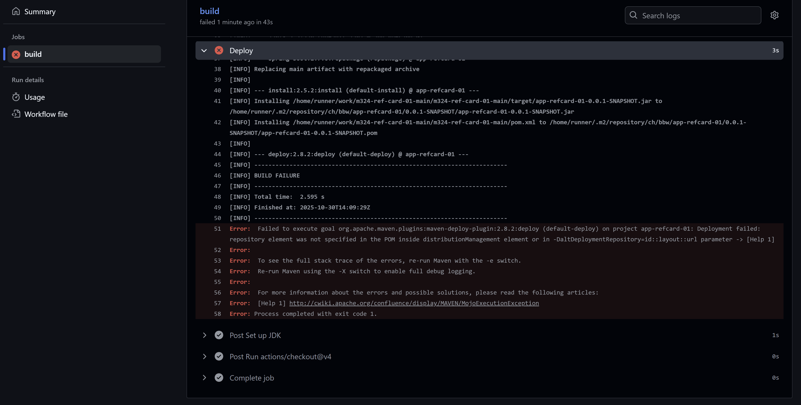

# Doku Auftrag GitHub CI/CD

- Altes Repo als ZIP heruntergeladen.




- Git initalisiert




- GitHub Repo erstellt:




- Lokales Repo auf GitHub gepusht:




- Folgendes Yaml File im Folder `./.github/workflows` geschrieben, und gepusht:
```yaml

name: MyFlow

on:
  push:
    branches: [ master ]
  pull_request:
    branches: [ master ]

jobs:
  build:
    runs-on: ubuntu-latest

    steps:
      - uses: actions/checkout@v4
      - name: Set up JDK
        uses: actions/setup-java@v4
        with:
          distribution: 'temurin'
          java-version: '17'
          cache: 'maven'     
      - name: Build & Test
        run: mvn -B -ntp verify
      - name: Deploy
        run: mvn -B -ntp deploy
```

- Leider hat die Pipeline einen Fehler:




- Der Fehler sagt, die falsche Java-Version sei benutzt worden. Ich korrigiere das Java-Version im Yaml von 11 auf 17 und pushe das Ganze nochmals. Build und Test funktioniert jetzt, aber etwas anderes funktioniert jetzt nicht:




- 